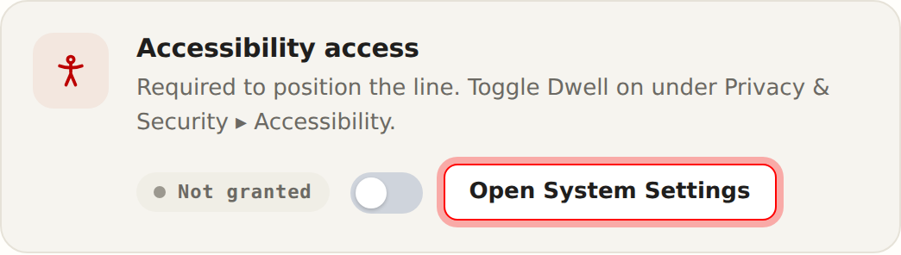
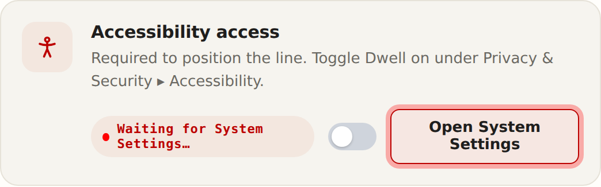
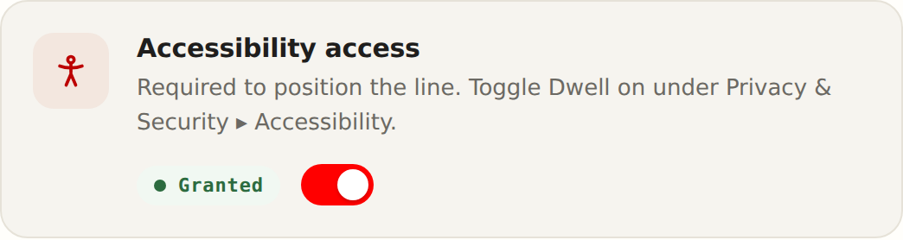

# Onboarding — "Grant access" step

The macOS Setup window's **Accessibility access** card. The
**Open System Settings** button opens the Accessibility pane on every press
(until access is granted) and wears a **red outline** as long as access is off,
so it reads as the required next action. Once macOS reports access is granted,
the card flips to **Granted** and the button clears.

| State | Screenshot |
|---|---|
| Not granted — red-outlined button (the required action) |  |
| Waiting — pressing it opens System Settings; the app polls the live permission |  |
| Granted — button clears, switch turns on |  |

Regenerate: render `../../macos/SponsorOverlay/Sources/SponsorOverlay/Resources/onboarding/index.html`
in a browser (the standalone preview simulates the permission grant) and capture
the `.perm-card` on the "Grant access" step.
