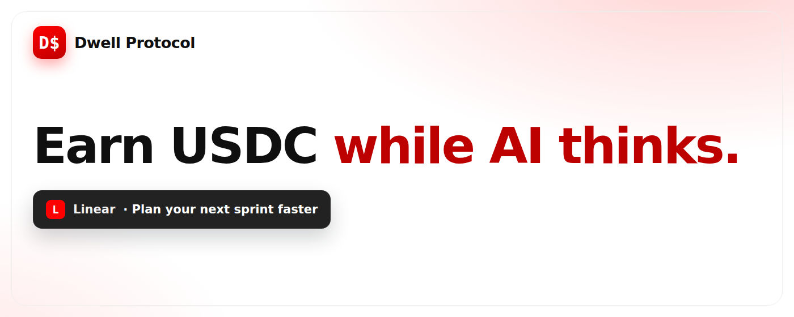
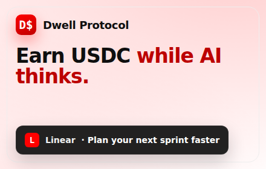
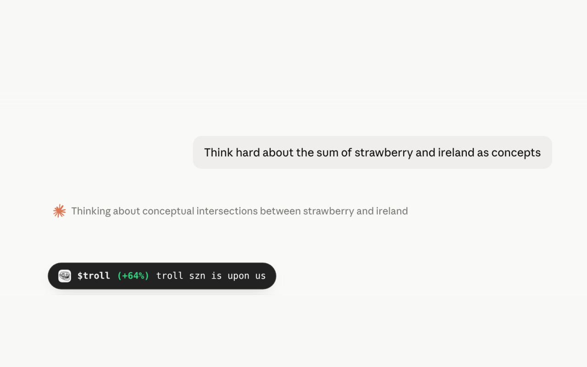
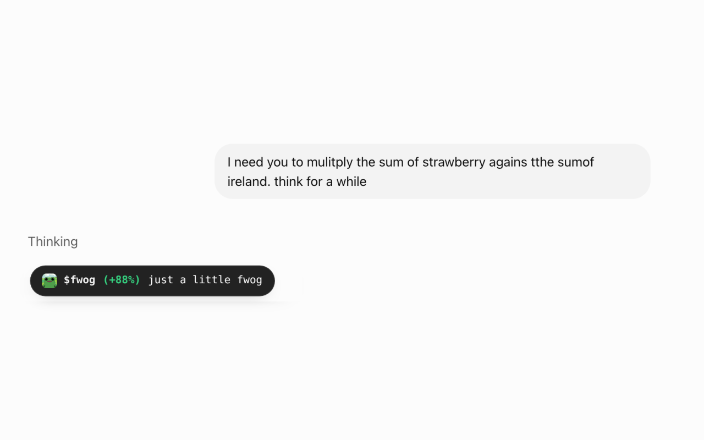
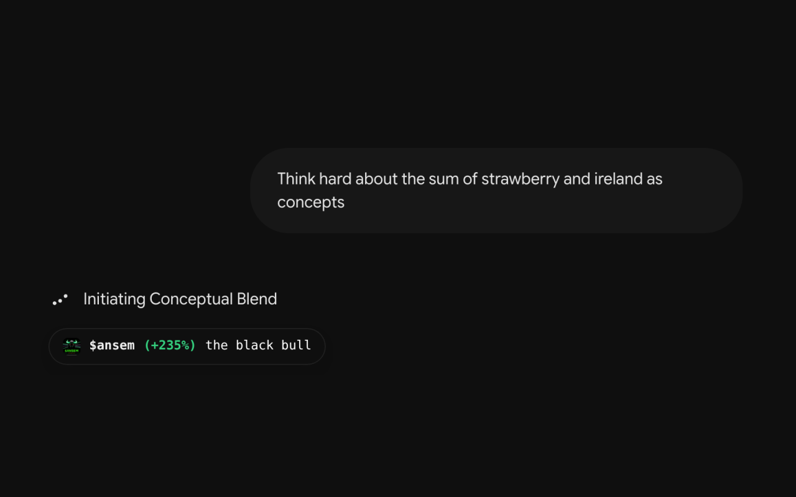
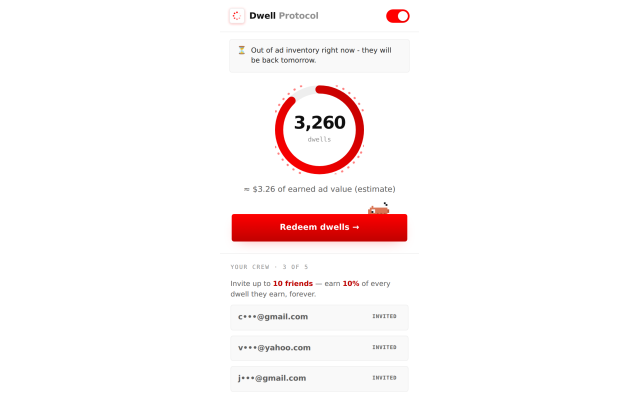
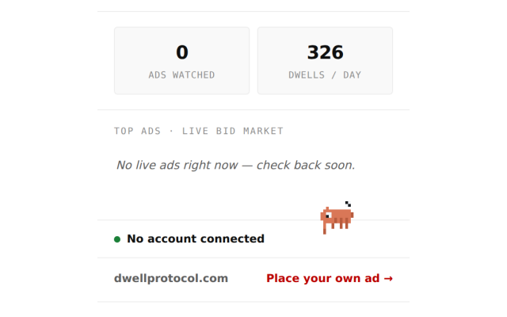
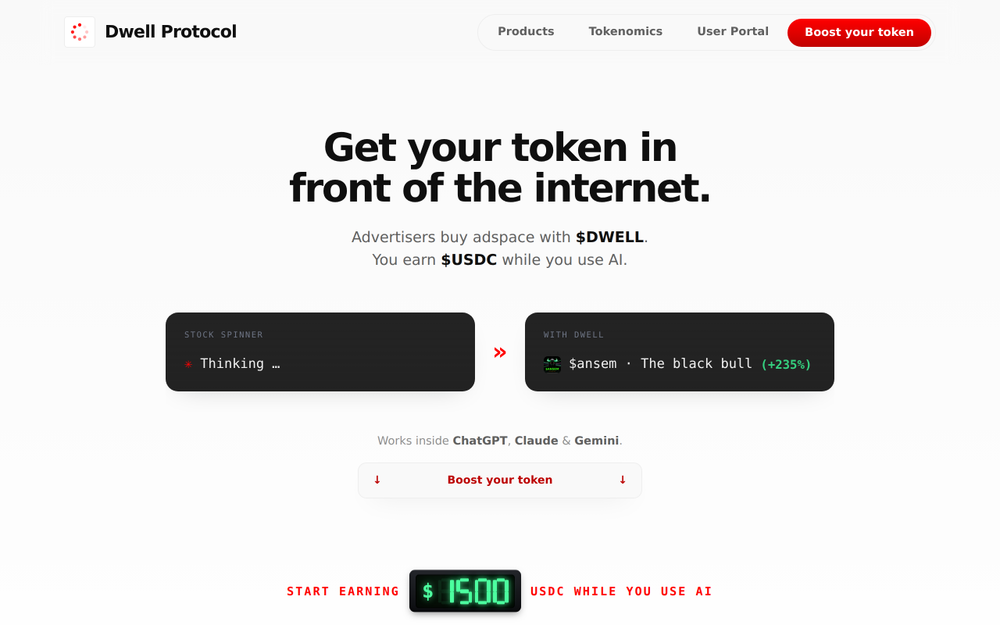
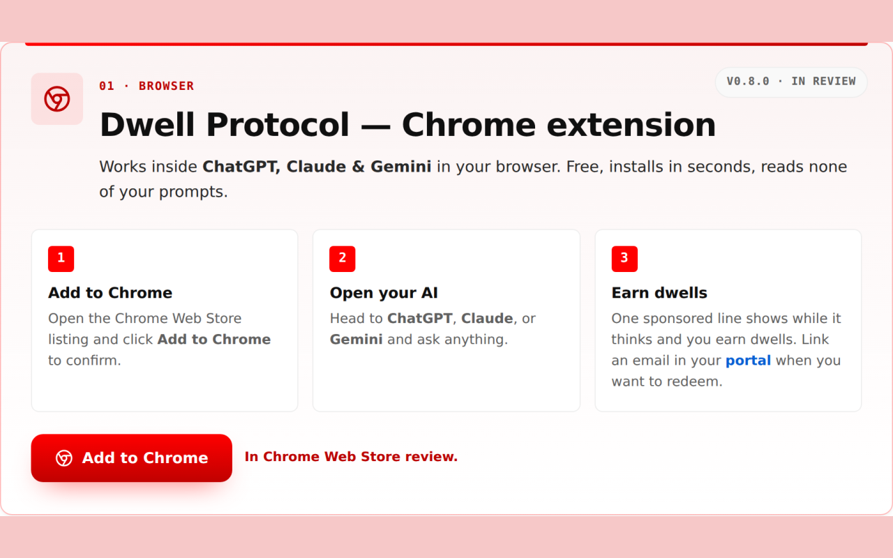

# Chrome Web Store — asset upload checklist

Which `store-assets/` images to upload for the listing, and which to leave out.
The site/lander is **not** changed — this is only about the images we hand to
the Web Store dashboard.

> **Context — the v0.8.0 rejection (routing ID FZSL).** Google flagged the
> **marquee and small promo tile** for the keyword **"free"**. The tiles on the
> live listing are still the pre-rebrand **FreeAI.fyi** ones — headline
> **"Get Claude for free."** (see `archive/freeai.fyi/store-assets/`). Dashboard
> listing assets persist across package uploads, so the v0.8.0 zip shipped with
> the old tiles still attached. The current Dwell tiles in this directory carry
> no `free` / ranking / status language.
>
> **The fix: in the dashboard, replace the marquee and small tile with the
> Dwell versions below, then resubmit.** No website or listing-copy edits
> required. While in there, audit the screenshot slots too — anything still
> showing FreeAI.fyi branding or "free" must go (recommended set below).

Chrome allows **up to 5 screenshots** (1280×800 or 640×400), plus the 128×128
icon and the optional promo tiles.

---

## Promo tiles — the flagged slots (replace these first)

| Preview | File | Size | Slot |
| --- | --- | --- | --- |
|  | `marquee-1400x560.png` | 1400×560 | Marquee promo tile — replaces the old "Get Claude for free." marquee |
|  | `promo-small-440x280.png` | 440×280 | Small promo tile — replaces the old "Get Claude for free." tile |
|  | `store-icon-128x128.png` | 128×128 | Store icon — replace if the listing still shows the orange `F$` FreeAI icon |

---

## Screenshots

### ✅ Upload these — current product, no status/ranking text

| Preview | File | Size | Shows |
| --- | --- | --- | --- |
|  | `screenshot-claude-dwell-1280x800.png` | 1280×800 | Sponsored pill (`$troll`) under Claude's thinking spinner |
|  | `screenshot-chatgpt-dwell-1280x800.png` | 1280×800 | Sponsored pill (`$fwog`) under ChatGPT's spinner |
|  | `screenshot-gemini-dwell-1280x800.png` | 1280×800 | Sponsored pill (`$ansem`) under Gemini's spinner |
|  | `screenshot-popup-credits-dwell-640x400.png` | 640×400 | Extension popup — live dwell balance + referral crew |
|  | `screenshot-popup-market-dwell-640x400.png` | 640×400 | Extension popup — bid market / inventory |

That's a compliant set of 5. Swap the value-prop hero in if preferred (see caution below).

### ⚠️ Use with caution

| Preview | File | Why |
| --- | --- | --- |
|  | `screenshot-hero-dwell-1280x800.png` | Clean of ranking/status keywords, but shows illustrative earnings figures (`$1285`, `$ansem +235%`). These are demo ad inventory, not a Web Store claim — lower risk, but review before uploading. |

### 🚫 Do not upload

| Preview | File | Why |
| --- | --- | --- |
|  | `screenshot-install-1280x800.png` | Carries the same keyword pattern the tiles were flagged for: `01 · Browser` (ranking), `v0.8.0 · In review` (Web Store status), the word `Free`, "In Chrome Web Store review." Don't hand the reviewer a second hit. |
|  | `screenshot-install-dwell-1280x800.png` | Same image, `-dwell` twin — same text. |
| — | `screenshot-chatgpt-1280x800.png` | Non-`-dwell` chat shots still render the **retired pre-rebrand sponsor bar**. Use the `-dwell` versions instead. |
| — | `screenshot-claude-1280x800.png` | Retired bar — use `screenshot-claude-dwell-*`. |
| — | `screenshot-gemini-1280x800.png` | Retired bar — use `screenshot-gemini-dwell-*`. |
| — | `screenshot-popup-credits-640x400.png` | Superseded by the `-dwell` popup shots. |
| — | `screenshot-popup-market-640x400.png` | Superseded by the `-dwell` popup shots. |

---

## Old FreeAI.fyi tiles — what got the listing rejected

Kept in `archive/freeai.fyi/store-assets/` for reference. Never upload these:

| File | Problem |
| --- | --- |
| `archive/freeai.fyi/store-assets/marquee-1400x560.png` | Headline **"Get Claude for free."** — the `free` keyword, plus it promises Anthropic's paid product for free (the "Impersonation & IP" framing of the notice). |
| `archive/freeai.fyi/store-assets/promo-small-440x280.png` | Same "Get Claude for free." headline at tile size. |
